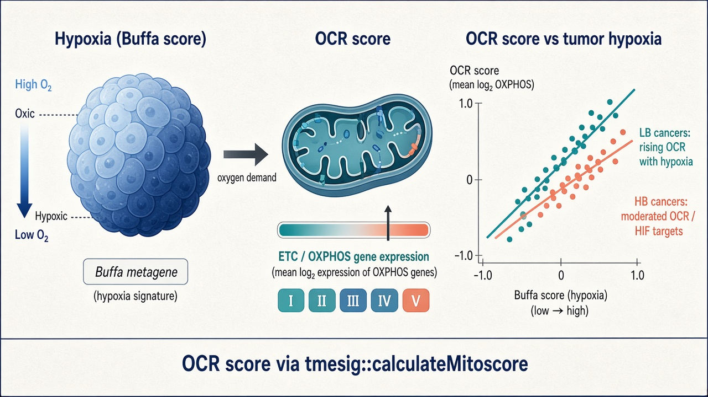

<table>
<tr>
<td width="100%">

# OCRscore

Code accompanying the preprint that defines and applies the **OCR score**
(oxygen consumption / OXPHOS transcriptional score) in human tumors.

**Calculate the OCR score** (and the Buffa hypoxia score, plus other tumor
microenvironment signatures) with the R package
[`spakowiczlab/tmesig`](https://github.com/spakowiczlab/tmesig):

```r
# install.packages("devtools")
devtools::install_github("spakowiczlab/tmesig")
library(tmesig)

# OCR score = mean log2(expression + 1) over the OCR / OXPHOS gene set
ocr <- calculateMitoscore(gene_matrix, mito.genes = inputGenes("Mitoscore"))

# Buffa hypoxia metagene (Buffa et al., 2010) — same package
buffa <- calculateBuffa(gene_matrix, buffa.genes = inputGenes("Buffa"))

# Other signatures (immune, metabolism, phenotype scores, …)
# are also provided via inputGenes() / calculateAvgZScore() — see the
# tmesig README and documentation.
```

> Historical note: the OCR score was previously referred to as the
> **mitoscore** in code (`calculateMitoscore()`, `inputGenes("Mitoscore")`).
> The biology is unchanged; this repository uses the OCR score name going
> forward. Package function names in `{tmesig}` retain the older API for
> compatibility.

</td>
<td width="160" valign="top" align="right">

<a href="https://github.com/spakowiczlab/tmesig">
  
</a>

</td>
</tr>
</table>

## Citation

Please cite the preprint:

> Benej M, Benejova K, Fergatova A, Lisi R, Travis K, Kreamer M, Webb A, Dravillas C, Hoyd R, Bayrali-Ulker E, Thoutham AS, Spakowicz D, Denko NC.  
> **Mitochondrial Oxygen Consumption Drives Lung Tumor Hypoxia and Resistance to Therapy via Copy Number Alteration in Mitochondrial Electron Transport Subunit NDUFB5.**  
> *bioRxiv* (posted 28 July 2026).  
> doi:[10.64898/2026.07.27.741033](https://doi.org/10.64898/2026.07.27.741033)  
> Full text: <https://www.biorxiv.org/content/10.64898/2026.07.27.741033v1.full>

If you use the scoring software, also cite / acknowledge
[`spakowiczlab/tmesig`](https://github.com/spakowiczlab/tmesig)
([Zenodo](https://doi.org/10.5281/zenodo.5781865)).

---

## Graphical abstract



---

## Locations of the manuscript figure scripts

**Start here:** [`dissemination/manuscript/`](dissemination/manuscript/) — knit each notebook directly.

| Item | Script | Reproducible from repo alone? |
|------|--------|-------------------------------|
| Figure 1A–B | [`dissemination/manuscript/figure_1.Rmd`](dissemination/manuscript/figure_1.Rmd) | **Yes** — tracked tables under `dissemination/manuscript/data/` |
| Figure 4 stats | [`dissemination/manuscript/figure_4.Rmd`](dissemination/manuscript/figure_4.Rmd) | **Yes** — tracked Excel under `exploratory/data/` |
| Figure 3A–C | [`dissemination/manuscript/figure_3.Rmd`](dissemination/manuscript/figure_3.Rmd) | Needs external TCGA / PCAWG / `many-cancers` (`paths.json`) |
| Supplement | [`dissemination/manuscript/Supplement.Rmd`](dissemination/manuscript/Supplement.Rmd) | Needs external `many-cancers/` |

Details: [`dissemination/manuscript/README.md`](dissemination/manuscript/README.md).

### Exploratory analyses

[`exploratory/`](exploratory/) holds drafts and side analyses; use
`dissemination/manuscript/` for published panels.

---

## Repository layout

```text
OCRscore/
├── README.md
├── assets/                      ← hex sticker + graphical abstract
├── paths.example.json           ← only needed for Fig 3 / Supplement
├── dissemination/
│   ├── manuscript/              ← figure notebooks + helpers + Fig 1 data
│   └── grants/
└── exploratory/                 ← drafts / side analyses
```

---

## External datasets (hosted elsewhere — not in this repo)

The manuscript pipeline expects three large input trees under `data_root`
(see [`paths.example.json`](paths.example.json)). These are **not** duplicated
here. Two are public cBioPortal downloads; one is a lab-derived summary table
built from those public sources.

### 1. `tcga-expression/` — TCGA PanCancer Atlas (cBioPortal, 2018)

**What the code reads** (per cancer subdirectory):

- `data_RNA_Seq_v2_expression_median.txt` — gene-level RNA-Seq (Hugo symbol + Entrez ID columns)
- `data_clinical_supp_hypoxia.txt` — sample-level `BUFFA_HYPOXIA_SCORE`

**Provenance (from filenames + download scripts in this repo):**

- cBioPortal study IDs of the form `{disease}_tcga_pan_can_atlas_2018`
  (e.g. `brca_tcga_pan_can_atlas_2018`, `lusc_tcga_pan_can_atlas_2018`)
- Directory names under `tcga-expression/` are expected to start with the
  disease abbreviation before an underscore (`brca_…`, `kirc_…`, …); see
  [`dissemination/manuscript/R/loadAndFormatTCGA.R`](dissemination/manuscript/R/loadAndFormatTCGA.R)
- An exploratory download helper targeted the cBioPortal Datahub tarballs:
  `https://cbioportal-datahub.s3.amazonaws.com/{study}_tcga_pan_cancer_atlas_2018.tar.gz`
  ([`exploratory/scripts/download_cna_pbs.Rmd`](exploratory/scripts/download_cna_pbs.Rmd);
  note the historical spelling variant in that script — the live study IDs use
  `pan_can_atlas_2018`)

**Where to get it:**

- Study browser: [cBioPortal — TCGA PanCancer Atlas](https://www.cbioportal.org/)
  (filter / search “pan_can_atlas_2018”)
- Bulk download: [cBioPortal Datahub](https://github.com/cBioPortal/datahub)
  / Datahub assets (portal “Download” links on each study page)
- Hypoxia scores: the `BUFFA_HYPOXIA_SCORE` column is distributed with those
  studies as a **supplemental clinical** file on cBioPortal (Buffa hypoxia
  metagene; Buffa et al., *Br J Cancer* 2010). Exact clinical-attribute packaging
  can change with Datahub updates — if `data_clinical_supp_hypoxia.txt` is
  missing in a fresh download, pull the Buffa attribute from the study’s
  clinical data or recompute with `{tmesig}`.

**Used for:** Figure 3C (*PDK1*, *PDK3*, *NDUFA4L2* vs Buffa). KIRC is excluded in code.

### 2. `pancan_pcawg_2020/` — PCAWG pan-cancer (cBioPortal)

**What the code reads:**

- `data_mrna_seq_fpkm.txt`
- `data_mirna.txt` (uses `hsa-miR-210-3p`)
- `data_clinical_sample.txt` (histology filters)

**Provenance:**

- Local folder name and cBioPortal study ID: **`pancan_pcawg_2020`**
- File names match standard cBioPortal Datahub packaging for that study
- Buffa scores are **recalculated in this pipeline** with
  `tmesig::calculateBuffa()` (not read from a PCAWG clinical hypoxia file),
  using the Buffa gene set plus alternate symbols present in PCAWG
  (`PNP`, `HILPDA`, `MRGBP`, `AK3`, `ESRP1`, `CTSV`)

**Where to get it:**

- Study page: [cBioPortal — `pancan_pcawg_2020`](https://www.cbioportal.org/study/summary?id=pancan_pcawg_2020)
- Download the study archive from the portal / Datahub, unpack as
  `pancan_pcawg_2020/`

**Primary publication:** ICGC/TCGA Pan-Cancer Analysis of Whole Genomes
Consortium, *Nature* (2020) and related PCAWG companion papers.

**Used for:** Figure 3C (MIR210 vs Buffa). Kidney-RCC and Kidney-ChRCC samples
are excluded in code.

### 3. `many-cancers/` — precomputed Buffa vs pathway-average tables

**What the code reads:** tab-delimited files matching

```text
MaxLimitsallLogExpr_<cancer>_AverageGeneExpr_vs_BUFFA_CorrelationScatterPlot_<GENESET>.txt
```

with gene-set suffixes such as:

- `WP_ELECTRON_TRANSPORT_CHAIN_OXPHOS_SYSTEM_IN_MITOCHONDRIA` → OCR score
- `BIOGEN…` → mitochondrial biogenesis
- `GOBP_MITOPHAGY…` → mitophagy

Each table has at least `BUFFA_HYPOXIA_SCORE` and `AvgExpr` (sample average of
the gene set). See [`dissemination/manuscript/R/readAndFilter.R`](dissemination/manuscript/R/readAndFilter.R).

**Provenance (important):**

- These are **derived summary tables**, not a raw public download.
- Naming (`MaxLimitsall…CorrelationScatterPlot…`) indicates exports from a
  Denko-lab / collaborator analysis that scored TCGA samples for Buffa and for
  pathway-average expression (related lab folders elsewhere are labeled e.g.
  `DenkoMay2022_…`).
- They are stored on institutional lab storage (historically Box / T-drive under
  `…/data/many-cancers/`) and are **intentionally not redistributed** in this
  repository.

**How to regenerate instead of copying the lab folder:**

1. Start from the same TCGA PanCancer Atlas expression matrices + Buffa scores
   (section 1), or recompute Buffa with `{tmesig}`.
2. Score each sample with the OCR / biogenesis / mitophagy gene lists
   (see [`exploratory/data/TableS1_signature-gene-sets.csv`](exploratory/data/TableS1_signature-gene-sets.csv)
   and `tmesig::calculateMitoscore()` / `inputGenes("Mitoscore")`).
3. Write per-cancer tables with columns `BUFFA_HYPOXIA_SCORE` and `AvgExpr`
   (or adapt `loadOCRscores()` / `loadManyScores()` to your layout).

**Used for:** Figure 3A–B and the multi-cancer supplementary correlations;
Figure 1A (Buffa column only).

### 4. `tcga_normal_tissue/buffa_avgZscore.csv` — adjacent-normal / lung Buffa (Figure 1B)

**What the code reads:** a CSV with at least `source` and `buffa.score`, produced
by scoring TCGA adjacent-normal and related normal/tumor expression matrices
with `{tmesig}` (see exploratory draft
`exploratory/scripts/buffa_normalTissue.Rmd`).

**Provenance:** lab-derived summary (historically under
`…/tcga_normal_tissue/buffa_avgZscore.csv`). Not redistributed here; regenerate
with `tmesig::calculateBuffa()` from the same expression inputs, or set
`buffa_normal_file` in `paths.json`.

**Used for:** Figure 1B (healthy lung, adjacent-normal LUAD/LUSC, LUAD/LUSC tumors).

### What *is* in this repo

- Curated subunit OS table for Figure 4:
  [`exploratory/data/Subunit OS 11242021.xlsx`](exploratory/data/Subunit%20OS%2011242021.xlsx)
- Signature gene-set lists:
  [`exploratory/data/TableS1_signature-gene-sets.csv`](exploratory/data/TableS1_signature-gene-sets.csv)

---

## Reproducibility checklist & known blockers

Scope: **`dissemination/manuscript/`** (the review pipeline).

Reviewers **can** reproduce the statistical logic and plotting code there. Full end-to-end regeneration of every panel requires the
external trees above (public cBioPortal downloads and/or regenerated
`many-cancers/` summaries). Known issues:

1. **External expression inputs (Figures 3 / Supplement only)** — configure
   `paths.json` from [`paths.example.json`](paths.example.json) so `data_root`
   contains `many-cancers/`, `tcga-expression/`, and `pancan_pcawg_2020/` (see
   [External datasets](#external-datasets-hosted-elsewhere--not-in-this-repo)).
   Figures **1** and **4** do not need this.

2. **`paths.json` is gitignored** — only required for Fig 3 / Supplement.
   Copy `paths.example.json` → `paths.json` and set a local `data_root`.

3. **`{tmesig}` from GitHub** — needed to recalculate Buffa for PCAWG in
   Figure 3C (`calculateBuffa`). Figure 1 uses precomputed Buffa tables in
   `dissemination/manuscript/data/`.

4. **Figure 4 schematic vs stats** — `dissemination/manuscript/figure_4.Rmd` regenerates the
   permutation *P* values from the curated table
   [`exploratory/data/Subunit OS 11242021.xlsx`](exploratory/data/Subunit%20OS%2011242021.xlsx).
   That spreadsheet is an intentional curated input. The structural Complex
   I/II schematic in the paper is assembled from those annotations outside R.

5. **No lockfile yet** — package versions are not pinned with `renv`. Exact
   plot styling may differ slightly across ggplot2 versions.

6. **Repository rename** — formerly `mitoscore`. Some helper names still
   mention mitoscore for continuity with `{tmesig}` (`calculateMitoscore()`).

If a Datahub layout has changed since these analyses were frozen (~2021–2022),
contact the corresponding authors on the bioRxiv page for the exact archives
used in the preprint figures.

---

## License

MIT — see [LICENSE](LICENSE).
